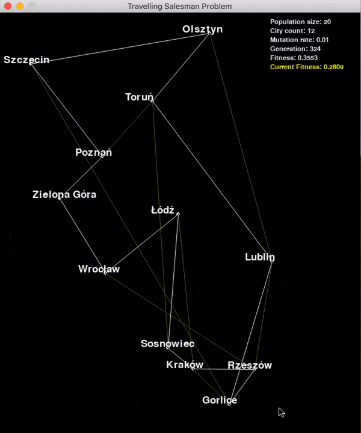

# Travelling Salesman Problem

**Tested on Python version:** 3.7  

**Important:** If you want to use your own coordinates for GraphicsBased TSP please note that function `map_cities_onto_screen` needs to be changed as it is hardcoded towards showing Poland.

**Average generations to solution:**
 * With graphics about **20k** (population_size=20)
 * With text about **600** (population_size=100)

# Text-based TSP
The program shows the cities of Poland based on a real latitude and longitude.  
Possibility of adding more cities.  
There are two modes available - **time-bounded** or **repetition-bounded**:  
<pre>
<b>GeneticAlgorithm</b>.run(<b>seconds</b>=<i>NUMBER_OF_SECONDS</i>)
</pre>
<pre>
<b>GeneticAlgorithm</b>.run(<b>reps</b>=<i>NUMBER_OF_REPETITIONS</i>)
</pre>

# Graphics-based TSP
Similar to the text-based program.  
Press **SPACE** to toggle program PAUSE _(notice that on the animation below)_.  

